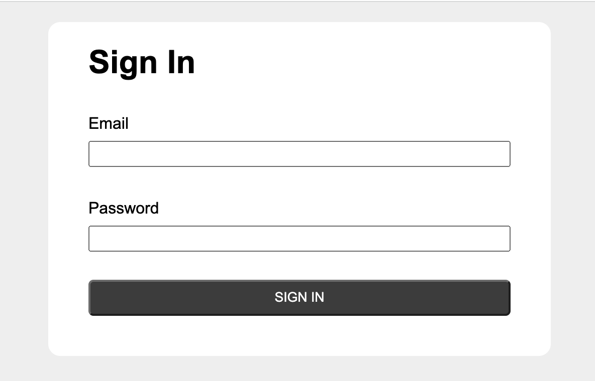
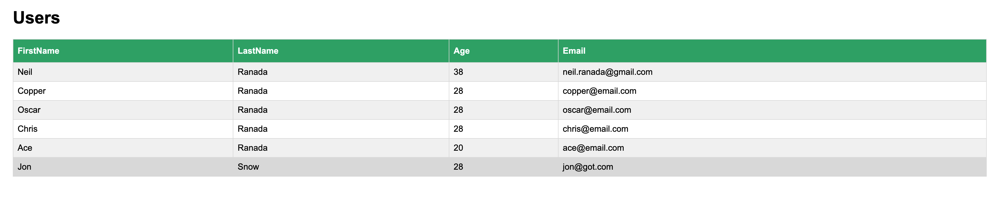

# Welcome to My Users App
***

## Task
Create a basic user database using a Model View Controller (MVC) architecture.

## Description
Created a basic user database using MVC architecture using the following files:
- app.rb
- my_user_model.rb
- view/index.html

### Part I: Model
Created a `class User` with methods for manipulating data in sqlite:
- create user
- get user
- get users
- update user
- destroy user

### Part II: Controller
Created a light server using Sinatra for interacting with a database: `db.sql`

Routes include:
- `POST` on `/users`. Receives inputs for firstname, lastname, age, password and email to create a user to store in a database
- `GET` on `/users`. Returns all users (without their passwords)
- `POST` on `/sign_in`. Sign into the app by receiving arguments for email and password. Creates a cookie tracked session containing the user_id
- `PUT` on `/users`. Updates the password of an authorized user who is logged in and returns the updated hash user information
- `DELETE` on `/sign_out`. Signs out the current user
- `DELETE on /users`. Signs out and deletes the record of the current user from the database

## Installation
In docode, navigate to the project folder containing app.rb: `cd users_app_demo`
- Install gems: ` gem install sinatra puma json sqlite3`
- In terminal, execute the application and start a server session: `ruby app.rb`
- Open a second terminal window to run commands in the "Usage" section below

## Usage
Use curl in terminal:
- Create a user (replace arguments as desired. ex. "password123"): `curl -X POST localhost:8080/users -d firstname=admin -d lastname=admin -d age=50 -d password=password123 -d email=admin@email.com`
- Return all users without the password column and check your new user exists: `curl -X GET localhost:8080/users`

In the browser:
- To view the user database in the browser, add `web-` to your docode url: `https://web-XXXXXXXXX-XXXX.docode.us.qwasar.io/`
- Sign in using the email and password you created

 

In the terminal:
- Sign in with credentials: `curl -c cookies.txt -X POST localhost:8080/sign_in -d email=admin@email.com -d password=password123`
- Recieve a new updated password and return hash of user if logged in with authorized credentials: `curl -b cookies.txt -X PUT localhost:8080/users -d email=admin@email.com -d password=password123`
- Sign out and delete current user: `curl -b cookies.txt -X DELETE localhost:8080/users`
- Check to see deleted user is no longer in table: `curl -X GET localhost:8080/users`

### The Core Team

Neil Ranada, Software Engineer

<i>Made at <a href='https://qwasar.io'>Qwasar Silicon Valley</a></i>

